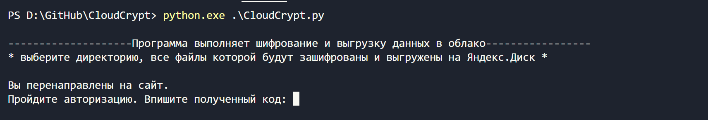
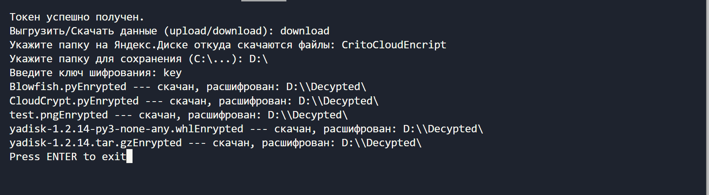

# CloudCrypt


The project is related to the implementation of secure data storage in cloud services such as Yandex.Disk and Google Drive. It uses the REST API of the cloud service library.
1) Allows you to encrypt data on the local host and upload it to the cloud.
2) Allows you to upload encrypted data from the cloud and decrypt it on the user's local computer.
The encryption algorithm is the Blowfish algorithm.

Project website: http://cloudcrypt.tilda.ws/

## Install

```
# git clone https://github.com/galazat/CloudCrypt.git && cd CloudCrypt
# pip install -r requirements.txt
```

## Usage

1. Start CloudCrypt
```
# python ./CloudCrypt.py
```
2. Next, you need to give the application permission to write and read files in the cloud drive. To do this, you need to enter the code that will be issued by Yandex.Disk to our application.



3. Next, you need to select the mode: download or upload. Select a folder on the cloud drive and a local folder. Enter the encryption key.
